# Introduction

This guide demonstrates my knowledge of git, GitHub, and the command line interface for version control and collaboration. Each step explains the best practices for reproducible and collaborative workflows. All commands were run using Git Bash on Windows.

## Step 1: Create a New RStudio Project and Quarto File

I created a new RStudio project called ETC5513_Assignment2 and created a Quarto document file called example.qmd. In the document, I added a YAML header (including the title, author, and HTML format), introduction section, and R code chunk that runs summary(cars) to produce a basic summary table.

A Quarto document combines text and executable R code in one file. I rendered the document to a HTML file which is shown below.

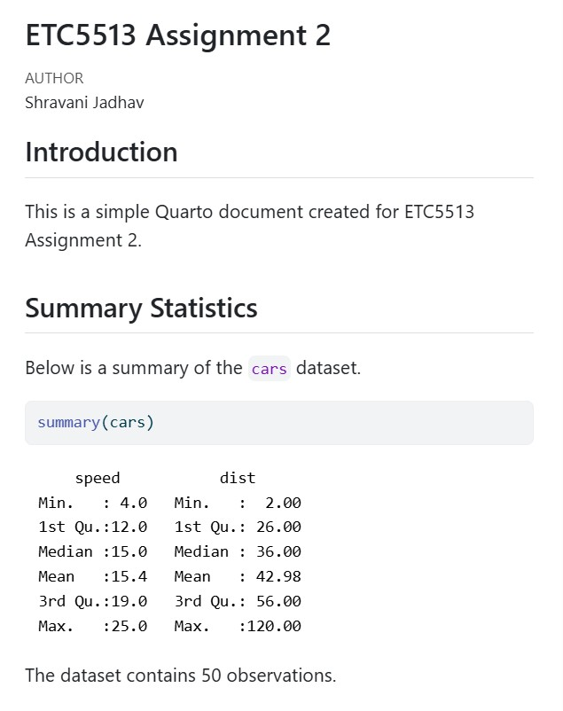{width="431"}

## Step 2: Initialise as a Git Repository and Push to GitHub

In Git Bash using the command cd, I changed my current directory to the assignment folder and initialised it as a local git repository with the use of git init. Then, I staged all the files by git add . and committed them all using git commit –m "Initial commit: add example.qmd and RStudio project"

Then I created a repository in GitHub named ETC5513_Assignment2. By using the commands git remote add origin (along with the SSH key from GitHub) and git push, I was able to connect my local repository to GitHub. The codes and the screenshots that demonstrate the process are shown below.

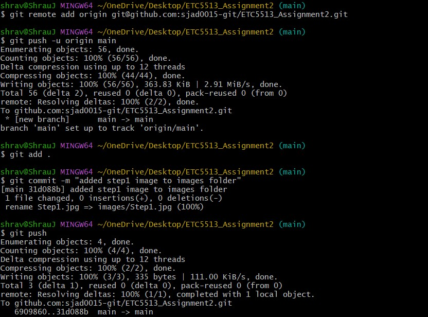{width="85%"}

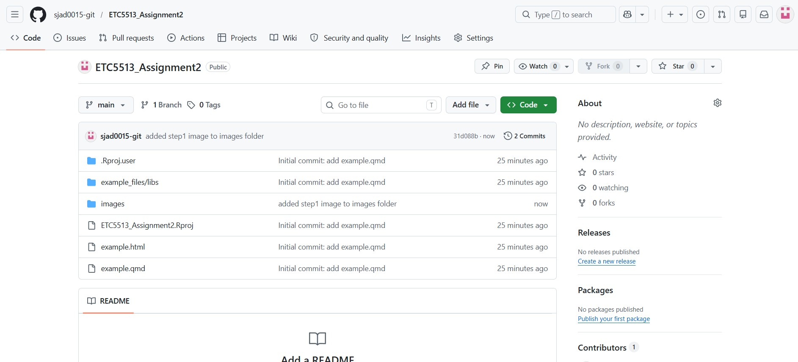{width="85%"}

## Step 3: Create testbranch and Modify example.qmd

I created a new branch named testbranch and also switched to it at once, using git switch -c testbranch. Now, I can make changes separately on this branch without affecting the main branch until required. On the new branch, I created a section on data visualization with a scatter plot of the cars dataset in example.qmd file. Then, I added, committed and pushed my changes to the remote repository as we did in Step 2, just this time in the testbranch.

``` bash
git add . 
git commit -m "Add data visualisation section to example.qmd on testbranch" 
git push -u origin testbranch
```

The screenshots below depict the success of push to GitHub.

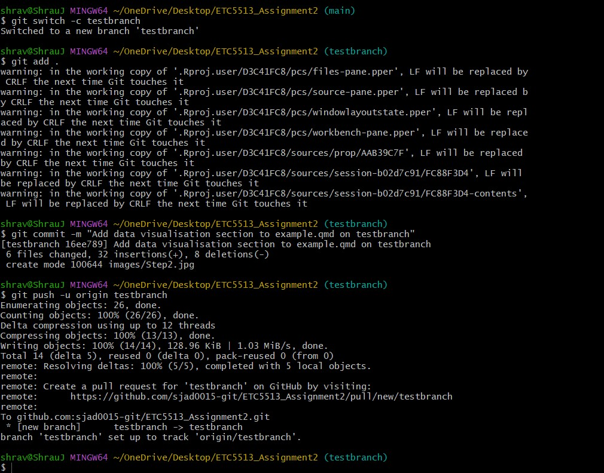{width="85%"}

{width="85%"}

## Step 4: Add Data Folder and Amend the Previous Commit

I created a data folder in the project and uploaded Assignment 1’s dataset in it. Instead of making a new commit, I used the git commit --amend command to incorporate the data folder in the last commit:

``` bash
git add .
git commit --amend --no-edit
git push --force origin testbranch
```

When we use git commit --amend, it changes the previous commit to reflect the newly added files instead of adding another commit. --no-edit prevents the change in the message of the existing commit and makes it useful when one forgets to include a file while committing.

As amending rewrites the commit hash, there will be a discrepancy between the remote and local versions. Therefore, git push --force is necessary. This operation should be restricted to a feature branch that belongs to one person and not a common branch such as main. The committed files and the data folder on GitHub are shown below.

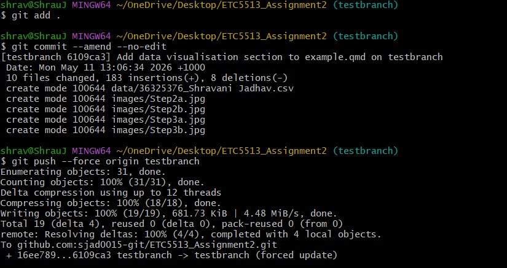{width="85%"}

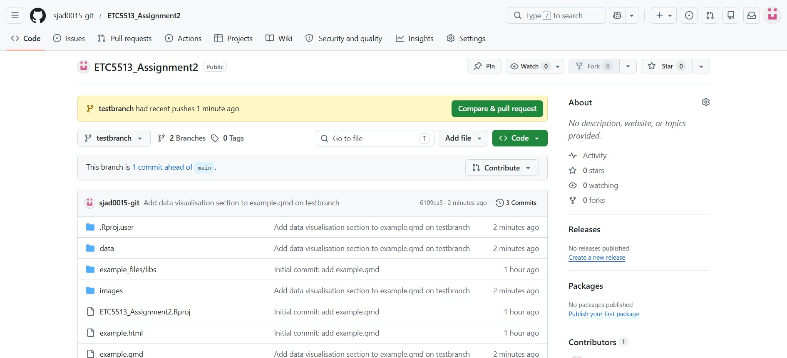{width="85%"}

## Step 5: Switch to Main and Create a Conflicting Change

I switched back to the main branch using the command git switch main. Then, I edited example.qmd in the same place where I made changes to testbranch, but the content is not the same; I added Speed Analysis instead of Data Visualisation. After that, I staged, committed, and pushed:

``` bash
git switch main
git add .
git commit -m "Add speed analysis section to main"
git push origin main
```

To create a merge conflict, I have set up a scenario that will lead to one. There will be a merge conflict if both branches make changes to the same lines in the same file but in a different way, hence git being unable to decide on what version is kept, and halting the whole process. The images below illustrate the changes made on the main branch.

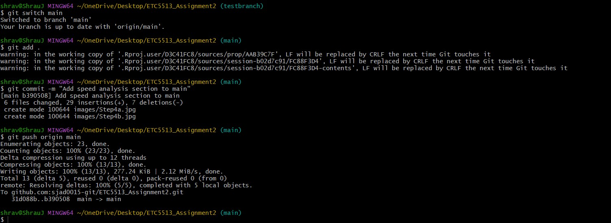{width="100%"}

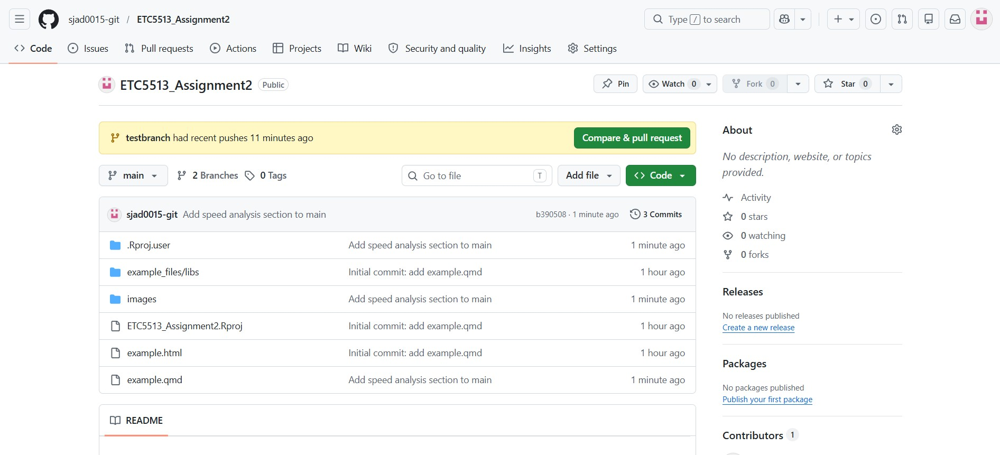{width="85%"}

## Step 6: Merge testbranch into Main and Resolve the Conflict

I merged testbranch into main using git merge testbranch. Git detected a conflict in example.qmd because both branches had changed the lines. Git added conflict markers to the file to show both versions.

HEAD means the branch, which is main. Everything between \<\<\<\<\<\<\< HEAD and ======= is the branch version. Everything between ======= and \>\>\>\>\>\>\> testbranch is the version. I edited example.qmd in RStudio by keeping both sections, but removed all conflict marker lines. Then I staged the file and completed the merge:

``` bash
git add .
git commit -m "Merge testbranch into main and resolve conflict in example.qmd."
git push origin main
```

The screenshots show conflict markers, in RStudio. They also show the state on GitHub.

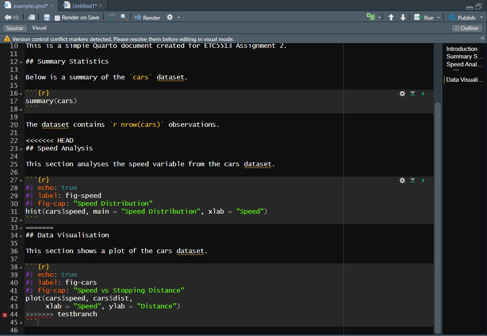{width="85%"}

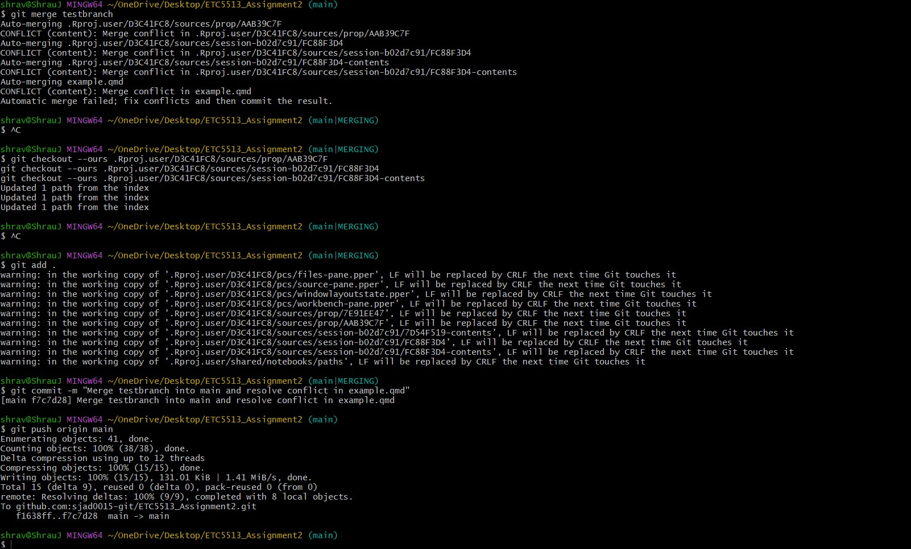{width="85%"}

## Step 7: Tag the Commit as v1.0

I made a tag called v1.0 on the current commit of main and I pushed it to GitHub. I used these commands:

``` bash
git tag -a v1.0 -m "Version 1.0: merge complete"
git push origin v1.0
git tag
```

An annotated tag is really useful because it stores extra information than a normal tag. Tags are important because they mark points in a projects history like version releases or report milestones. Normally git push does not push tags so I had to use git push origin v1.0 to share the v1.0 tag on GitHub. I ran git tag to make sure it was created successfully.

The screenshots below show how I created the tag in the terminal and now the v1.0 tag is visible, on GitHub.

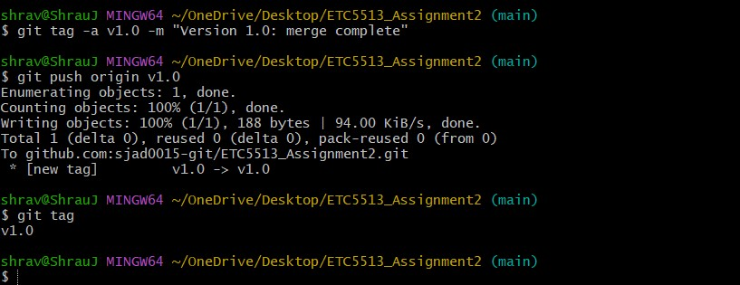{width="85%"}

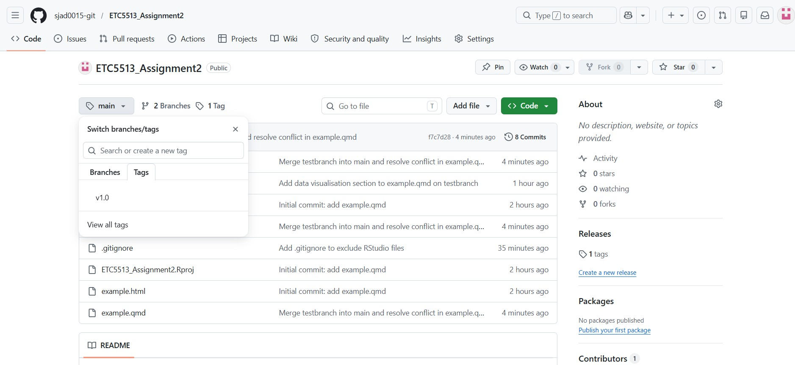{width="85%"}

## Step 8: Delete testbranch Locally and Remotely

After merging testbranch to the main branch successfully, I removed both the local and GitHub repositories of testbranch:

``` bash
git branch -d testbranch 
git push origin --delete testbranch 
git branch -v
```

Here, the use of lowercase d means safe delete because it will only execute if the branch has been fully merged without losing any work that had not been merged yet. Git push origin --delete is used to remove testbranch from GitHub because git branch -d can only delete it locally. Git branch -v verifies that the branch has been deleted.

Deleting merged branches helps in keeping the repository clean and avoids confusion in knowing which branches have not been deleted yet. The process is shown below.

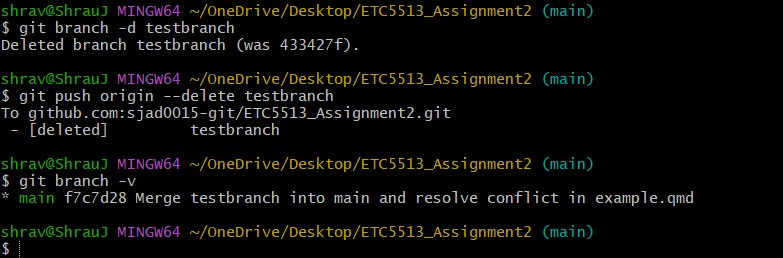{width="85%"}

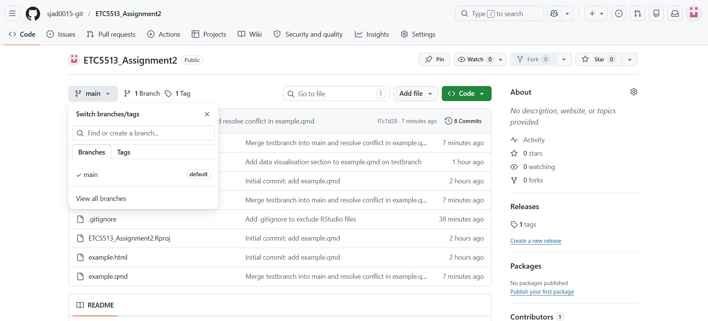{width="85%"}

## Step 9: Show the Commit Log in Condensed Form

I used the below command to print out the complete commit history in a concise manner:

``` bash
git log --oneline
```

The above command prints out each commit along with abbreviated commit hash and its message. It provides a concise overview of the whole commit history of the project. Below is the image of the complete commit history of this project.

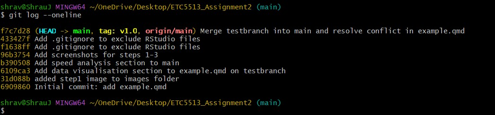{width="85%"}

## Step 10: Add a New Plot, Commit, and Undo with git reset --soft

I added an additional section on Pressure Analysis with a graph of the pressure data set in example.qmd. I then performed a commit operation. I then performed git reset --soft HEAD\~1 operation, which undid the commit but not the file changes.

``` bash
git add .
git commit -m "Add pressure plot section to example.qmd"
git reset --soft HEAD~1
git status
git log --oneline
```

The git reset –soft HEAD\~1 command rolls back the branch one commit but preserves the changes of files as staged changes. Such commands can be very useful in situations where one wants to undo the commit temporarily, without losing any changes in files, such as rewriting the commit message or making other changes before committing. After running git reset --soft, git status confirms the changes are still staged and git log --oneline confirms the commit has been removed from the history.

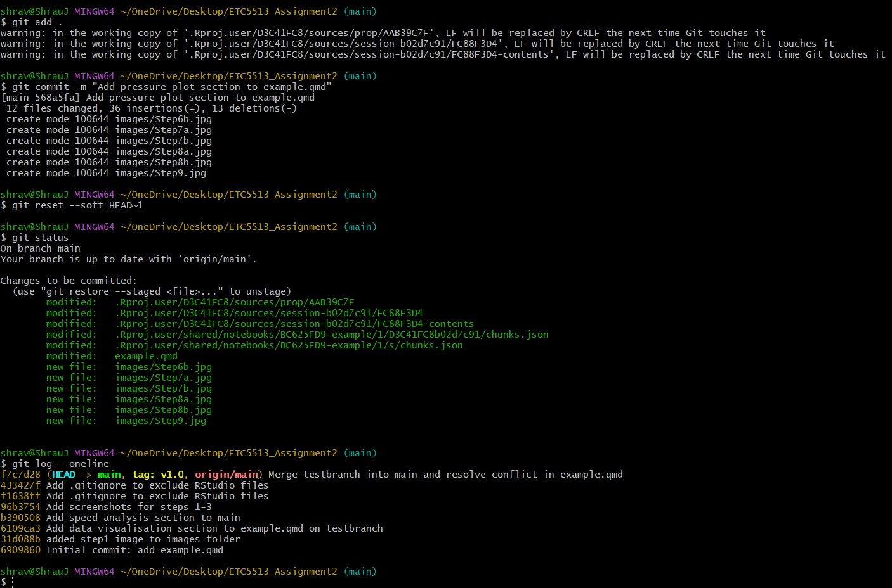{width="85%"}

# Conclusion

This guide has shown how to carry out a complete Git and GitHub workflow ranging from the initialization of a repository to dealing with merge conflicts and undoing commits. In carrying out the workflow, some important aspects of git have been illustrated. All these concepts make up the basis of collaborative and reproducible data analysis. The use of branches, appropriate commit messages, and version tagging makes it easy to collaborate with others on projects. Git ensures that nothing is fully lost and that all operations done are accounted for.
